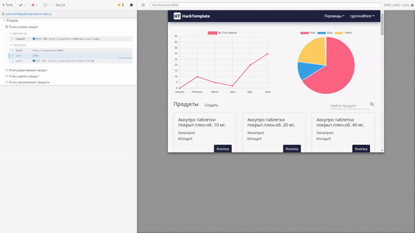

# AtomSkills
Продукт предназначен для решения задач по управлению перевозкой грузов: отслеживание 
перемещений, выполнение приема и выдачи грузов.
________________
### Инструкции и документация
1. Инструкция по развертыванию
   ```
   readme/Инструкция по развертыванию.docx
    ```
2. Техническое описание
   ```
   readme/Техническое описание.docx
    ```
3. Схема базы данных
   ```
   readme/Схема базы данных.docx
    ```
4. Инструкция по использованию
   ```
   readme/Инструкция по использованию.docx
    ```
5. Презентация продукта
   ```
   readme/Презентация team-01.pptx
    ```
________________
### Запуск end-to-end тестирования
1. Запустить проект
2. Запуск тестирования из директории /frontend
   ```bash
   npm run cypress
    ```
________________
### Запуск мобильного приложения
1. Запустить проект
2. Установить expo
   ```bash
   npm install expo-cli -- global
    ```
3. Запуск тестирования из директории /phone
   ```bash
   npm run start
    ```
________________
### Тестирование

Для запуска end to end тестирования необходимо запустить проект и выполнить следующую команду из дериктории frontend

 ```bash
 npm run cypress
 ```


